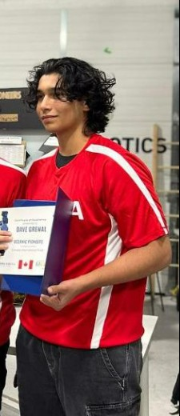

  
  

    <h1 class="title">Hi I'm J!</h1>
    

  <a href="https://scholar.google.com/citations?user=OVXyJ5MAAAAJ&hl=en" target="_blank" rel="noopener" style="display:inline-flex;align-items:center;gap:0.5rem;text-decoration:none;color:var(--color-accent-2);">
    <svg viewBox="0 0 24 24" role="img" aria-hidden="true" style="width:20px;height:20px;opacity:0.9;" xmlns="http://www.w3.org/2000/svg" fill="currentColor">
      <path d="M12 24a7 7 0 1 1 0-14 7 7 0 0 1 0 14zm0-24L0 9.5l4.838 3.94A8 8 0 0 1 12 9a8 8 0 0 1 7.162 4.44L24 9.5z"/>
    </svg>
    Google Scholar
  </a>
  <a href="https://github.com/jrosseruk" target="_blank" rel="noopener" style="display:inline-flex;align-items:center;gap:0.5rem;text-decoration:none;color:var(--color-accent-2);">
    <svg stroke="currentColor" fill="currentColor" stroke-width="0" viewBox="0 0 24 24" aria-hidden="true" style="width:20px;height:20px;opacity:0.9;" xmlns="http://www.w3.org/2000/svg"><path fill-rule="evenodd" clip-rule="evenodd" d="M12.026 2c-5.509 0-9.974 4.465-9.974 9.974 0 4.406 2.857 8.145 6.821 9.465.499.09.679-.217.679-.481 0-.237-.008-.865-.011-1.696-2.775.602-3.361-1.338-3.361-1.338-.452-1.152-1.107-1.459-1.107-1.459-.905-.619.069-.605.069-.605 1.002.07 1.527 1.028 1.527 1.028.89 1.524 2.336 1.084 2.902.829.091-.645.351-1.085.635-1.334-2.214-.251-4.542-1.107-4.542-4.93 0-1.087.389-1.979 1.024-2.675-.101-.253-.446-1.268.099-2.64 0 0 .837-.269 2.742 1.021a9.582 9.582 0 0 1 2.496-.336 9.554 9.554 0 0 1 2.496.336c1.906-1.291 2.742-1.021 2.742-1.021.545 1.372.203 2.387.099 2.64.64.696 1.024 1.587 1.024 2.675 0 3.833-2.33 4.675-4.552 4.922.355.308.675.916.675 1.846 0 1.334-.012 2.41-.012 2.737 0 .267.178.577.687.479C19.146 20.115 22 16.379 22 11.974 22 6.465 17.535 2 12.026 2z"></path></svg>
    GitHub
  </a>
  <a href="https://medium.com/@jrosseruk" target="_blank" rel="noopener" style="display:inline-flex;align-items:center;gap:0.5rem;text-decoration:none;color:var(--color-accent-2);">
    <svg stroke="currentColor" fill="currentColor" stroke-width="0" viewBox="0 0 24 24" aria-hidden="true" style="width:20px;height:20px;opacity:0.9;" xmlns="http://www.w3.org/2000/svg"><path d="M4.285 7.269a.733.733 0 0 0-.24-.619l-1.77-2.133v-.32h5.498l4.25 9.32 3.736-9.32H21v.319l-1.515 1.451a.45.45 0 0 0-.168.425v10.666a.448.448 0 0 0 .168.425l1.479 1.451v.319h-7.436v-.319l1.529-1.487c.152-.15.152-.195.152-.424V8.401L10.95 19.218h-.575L5.417 8.401v7.249c-.041.305.06.612.275.833L7.684 18.9v.319H2.036V18.9l1.992-2.417a.971.971 0 0 0 .257-.833V7.269z"></path></svg>
    Medium
  </a>
  <a href="https://www.linkedin.com/in/j-rosser/" target="_blank" rel="noopener" style="display:inline-flex;align-items:center;gap:0.5rem;text-decoration:none;color:var(--color-accent-2);">
    <svg stroke="currentColor" fill="currentColor" stroke-width="0" viewBox="0 0 24 24" aria-hidden="true" style="width:20px;height:20px;opacity:0.9;" xmlns="http://www.w3.org/2000/svg"><path d="M20 3H4a1 1 0 0 0-1 1v16a1 1 0 0 0 1 1h16a1 1 0 0 0 1-1V4a1 1 0 0 0-1-1zM8.339 18.337H5.667v-8.59h2.672v8.59zM7.003 8.574a1.548 1.548 0 1 1 0-3.096 1.548 1.548 0 0 1 0 3.096zm11.335 9.763h-2.669V14.16c0-.996-.018-2.277-1.388-2.277-1.39 0-1.601 1.086-1.601 2.207v4.248h-2.667v-8.59h2.56v1.174h.037c.355-.675 1.227-1.387 2.524-1.387 2.704 0 3.203 1.778 3.203 4.092v4.71z"></path></svg>
    LinkedIn
  </a>
  
  <a href="https://x.com/jrosseruk" target="_blank" rel="noopener" style="display:inline-flex;align-items:center;gap:0.5rem;text-decoration:none;color:var(--color-accent-2);">
    <svg xmlns="http://www.w3.org/2000/svg" fill="currentColor" class="bi bi-twitter-x" viewBox="0 0 16 16" id="Twitter-X--Streamline-Bootstrap" style="width:20px;height:20px;opacity:0.9;"><path d="M12.6 0.75h2.454l-5.36 6.142L16 15.25h-4.937l-3.867 -5.07 -4.425 5.07H0.316l5.733 -6.57L0 0.75h5.063l3.495 4.633L12.601 0.75Zm-0.86 13.028h1.36L4.323 2.145H2.865z" stroke-width="1"></path></svg>
  Twitter
  </a>
  <a href="mailto:jrosseruk@gmail.com" style="display:inline-flex;align-items:center;gap:0.5rem;text-decoration:none;color:var(--color-accent-2);">
    <svg xmlns="http://www.w3.org/2000/svg" width="16" height="16" fill="currentColor" class="bi bi-envelope" viewBox="0 0 16 16" style="width:20px;height:20px;opacity:0.9;"> <path d="M0 4a2 2 0 0 1 2-2h12a2 2 0 0 1 2 2v8a2 2 0 0 1-2 2H2a2 2 0 0 1-2-2zm2-1a1 1 0 0 0-1 1v.217l7 4.2 7-4.2V4a1 1 0 0 0-1-1zm13 2.383-4.708 2.825L15 11.105zm-.034 6.876-5.64-3.471L8 9.583l-1.326-.795-5.64 3.47A1 1 0 0 0 2 13h12a1 1 0 0 0 .966-.741M1 11.105l4.708-2.897L1 5.383z" stroke="currentColor" stroke-width="0.5"/></svg>
  Email
  </a>
    

  

I'm a DPhil student in Machine Learning at the University of Oxford, focusing on AI Safety, Interpretability, and Multi-Agent Systems.

Previously, I was a Research Scientist Intern at Spotify and worked with the UK AI Security Institute (AISI) on their Bounty Programme investigating automated design of agentic systems. I was also the founding Research Scientist at Convergence (acquired by Salesforce), contributing to Proxy, a state-of-the-art multimodal web agent with 100k+ users, and held senior engineering roles at Pynea and Artera, leading teams and shipping ML innovations.

I'm a member of LISA (London Initiative for Safe AI) and enjoy playing trumpet in a funk band, running bouldering socials, and helping new climbers get certified.

P.S. There are some easter eggs on this website - find one and drop the emoji in your email subject line!